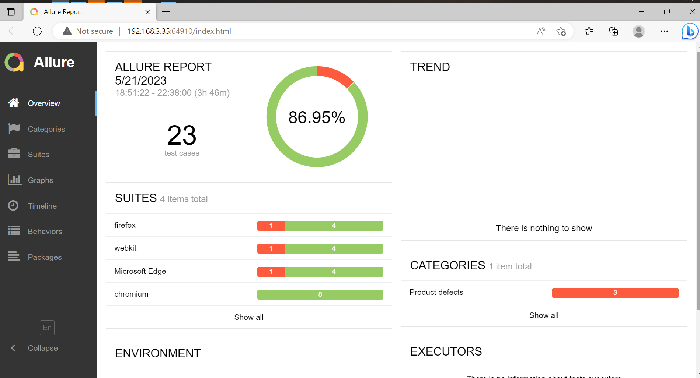

# auto-test
## **Playwright Framework**

Playwright is a framework for Automation Testing. It is built to enable cross browser, reliable end-to-end testing for web apps. Base on NodeJS, Playwright, Typescript.

## Feature in framework
- Cross Browser Testing.
- Run parallel, multi worker
- Support execution of tests in ui and api.
- Record video, take screenshot.
- Run retries of test.
- Generate html report by using playwright report.
- Generate html report by allure report.
- Have integrated Github action.

## Supported test
1. End to end testing.
2. Functional testing.
3. Api testing.

## Where is the test can be run
| Environment | Test Type | Description |
| ----------- | --------- | ----------- |
| Local | End to end, functional, Api | Run test on local machine. |
| Jenkins CI | End to end, functional, Api | Run test on Jenkins. |
| Github Action | End to end, functional, Api | Run test on Github Action. |

| Domain Test | Description |
| ----------- | ----------- |
| SIT | Test on the SIT env. |
| UAT | Test on the UAT env. |

### How to install lib and run the tests?

#### 1. Installation
Playwright requires [Node.js](https://nodejs.org/).
Before we run the test we need to install all library on this framework by using the following command.
```sh
npm install .
```

#### 2. Execute test
Run test with the following command
```sh
npm run test
```
#### 3. Run test in parallel
 Go to the Playwright.config.ts and then set the value you want at keyword is workers.
 ```sh
 workers: 4
 ```
 #### 4. Retry test
 Go to the Playwright.config.ts and then set the value you want at keyword is retries.
 ```sh
 retries: 2
 ```

#### 5. Run test in specific domain
Go to the .env and then set the value you want at keyword is ENV. ENV =1 test run on SIT. ENV != 1 test run on UAT.
```sh
ENV=1
```

#### 6. Generate Allure report.
```sh
npm run allure:generate
```
#### 7. Run multiple browser
Go to the Playwright.config.ts and then set the browser you want to run. Like chrome, firefox, safari.
```sh
 {
   name: 'firefox',
   use: { ...devices['Desktop Firefox'] },
 }
 ```
##### In This Framework

1. data-test package: Where is stored the data for test case.
2. page package: Where will define the element, function on a specific page.
3. tests package: where will using write the testscripts.
4. utils package: where will define the common functions.
5. .github\workflows: This is to use configure for github action.
6. .env: This is to use configure for environment.

###### The detail reports


